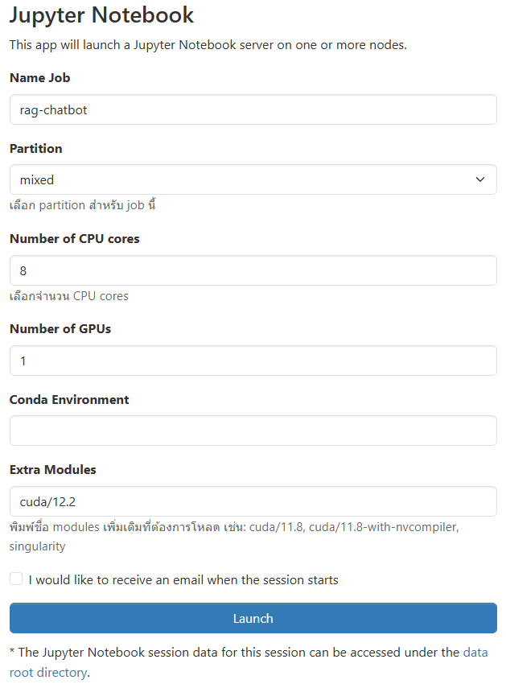
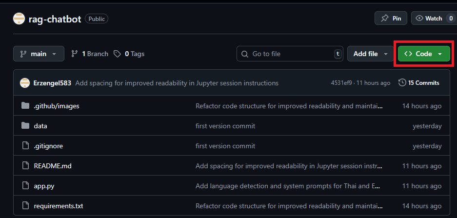
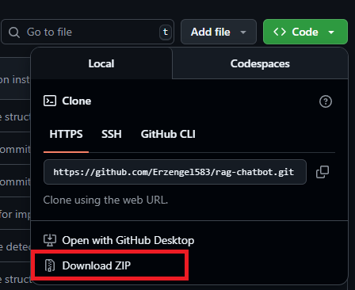

# RAG Chatbot (Qwen + HuggingFace + FAISS) & Multi-Format Support

This project is an open-source Retrieval-Augmented Generation (RAG) chatbot, designed for HPC workshops on Jupyter Notebook via Open OnDemand.
It integrates Qwen LLM, Hugging Face embeddings, and FAISS vector database to answer user queries based on custom documents (`.pdf`, `.docx`, `.txt`).

The chatbot supports Thai and multilingual Q&A, uses embeddings for context retrieval, and runs efficiently on GPU.

##  Features

* **Multi-Document Support:** Handles documents in `PDF`, `DOCX`, and `TXT`.
* **Vector Search with FAISS:** Stores embeddings in FAISS for fast document retrieval.
>FAISS (Facebook AI Similarity Search) is optimized for similarity search, making large-scale retrieval very fast.
* **Qwen LLM Integration:** Uses `Qwen/Qwen1.5-7B-Chat` for accurate and natural responses.
* **Multilingual Embeddings:** Powered by `intfloat/multilingual-e5-large` for cross-language search.
---

## ⚙️ How It Works

1.  **Build Vector Store:**
    * Place files in `data/`.
    * Files are processed, split into chunks, and embedded using embeddeding model.
    * Embeddings are stored in `vectorstore/db_faiss/`.
    >Why chunks? Large documents are split into smaller parts so the model can retrieve only the relevant context instead of loading the entire file.
2.  **Compare & Decide:** 
    * Each file is hashed (MD5).
    * If unchanged → skipped.
    * If new/modified → fully reprocessed and cached in `processed_texts/`.
    >This avoids reprocessing unchanged files, improving efficiency.
3.  **Query Processing:**
    * User query → FAISS retriever → fetch relevant chunks.
4.  **Answer Generation:** 
    * Retrieved context + user query → sent to Qwen/Qwen1.5-7B-Chat or other LLM models.
    * Model generates a Thai/Multilingual response, citing retrieved documents.

---

## 📂 Project Structure

```
rag-chatbot/
├── data/                  # <-- Put your source documents here (.pdf, .docx, .txt)
│   └── your_document.pdf
├── processed_texts/       # <-- Cached plain text versions of documents
│   └── your_document_processed.txt
├── vectorstore/           # <-- FAISS vector database
├── .gitignore             # <-- Specifies files/folders for git to ignore
├── app.py                 # <-- Main chatbot script
├── README.md              # <-- This file
└── requirements.txt       # <-- A list of Python dependencies
```

---

## Setup and Installation (Conda + Jupyter Notebook via Open OnDemand)

#### 1. Start a Jupyter Session



Fill in the job configuration as shown below:

* Name Job: Choose a descriptive name for your job (e.g., `rag-chatbot`).
* Partition: Select the partition for this job (e.g., `mixed` for both CPU + GPU usage).
* Number of CPU cores: Specify how many CPU cores you need (e.g., `8`).
* Number of GPUs: Number of GPUs to allocate (e.g., `1` for testing RAG model).
* Conda Environment: Leave blank if you want to use system defaults, or provide your custom conda env.
* Extra Modules: Add required modules such as `cuda/12.2` to ensure GPU compatibility.

> **Note:**
> * Choosing more CPUs and GPUs will speed up training but also consume more cluster resources.
> * The `Extra Modules` field is essential if your model requires CUDA or other libraries. For example:
>     * `cuda/11.8` for older compatibility
>     * `cuda/12.2` for newer models like Qwen or Llama
> * You can check available modules with the command:
>     ```bash
>     module avail
>     ```

#### 2. Obtain the Project Code

**Option A: Using `git clone` **

```bash
git clone https://github.com/Erzengel583/rag-chatbot
```

**Option B: Download ZIP **

* Go to the main page of the repository on GitHub.

* Above the file list, click the green < > Code button.



* Click on Download ZIP.



* Unzip the downloaded file to your desired location.

* Drag and Drop into your Jupyter Notebook session

* Navigate to the project directory 

```bash
cd rag-chatbot
```
#### 3. Create and Activate the Conda Environment
```bash
# Create environment (Python 3.10 recommended)
conda create --name rag-chatbot-env python=3.10 -y

# Activate the environment
conda activate rag-chatbot-env
```
>Conda is used here because it simplifies managing dependencies

#### 4. Install Dependencies
Install all required packages from the `requirements.txt` file.
```bash
pip install -r requirements.txt
```
>All required packages (LangChain, HuggingFace, FAISS, etc.) are listed in requirements.txt.

## Running the Chatbot

```bash
python app.py
```
##### The chatbot will:
* Ensure required directories exist.
* Build or update FAISS vector store from data/.
* Load embeddings + Qwen LLM.
* Start interactive chat loop.

Type your question and press `Enter`.
Type `exit` / `quit` / `bye` to stop the chatbot.

## Customization (Models & Parameters)
You can edit constants in `app.py`:
* Embedding Model
```python
EMBEDDING_MODEL = 'intfloat/multilingual-e5-large'
```
→ Replace with any HuggingFace sentence-transformer model.

>For example, if you want purely English documents, you could switch to all-MiniLM-L6-v2.

* LLM
```python
LLM_MODEL = "Qwen/Qwen1.5-7B-Chat"
```
→ Replace with another HuggingFace chat model (e.g. Llama2).

>Qwen is selected here because it supports Thai and multilingual input.

* Chunking Parameters
```pyhton
text_splitter = RecursiveCharacterTextSplitter(chunk_size=1000, chunk_overlap=200)
```
→ Adjust for document splitting.

>Larger chunks = fewer embeddings but less precise retrieval. Smaller chunks = more precise but larger vector DB.

* Retriever Parameters
```pyhton
retriever = db.as_retriever(search_kwargs={'k': 5})
```
→ Change k for number of retrieved chunks.

>Higher k = more context but slower response. Lower k = faster but possibly missing details.